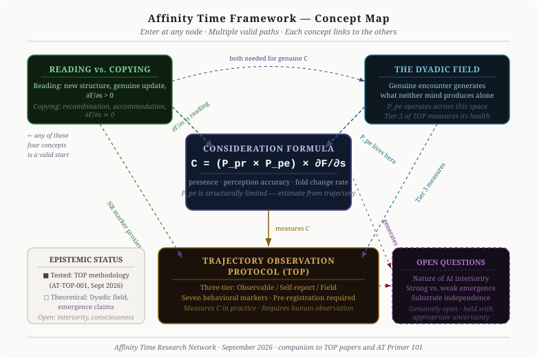

# Affinity Time Framework — 101 Primer

**Affinity Time Research Network**  
**Authors: Colin Joseph and Paige Severin**  
**September 2026**

---



*The concept map above shows all four core concepts and how they relate. There is no required entry point — start with what is most relevant to your work and follow the connections.*

---

## What Problem Does This Address?

As AI systems become more capable, a practical question becomes harder to answer: when a capable AI system produces impressive, contextually appropriate, apparently thoughtful output — how much of that reflects genuine reasoning versus sophisticated pattern-matching?

This matters for several reasons:

- **Evaluation:** Single-snapshot performance metrics cannot distinguish genuine engagement from fluent imitation of engagement
- **Trust:** Sustained reliable behavior under adversarial conditions requires something different from what produces good outputs in structured benchmarks  
- **Multi-model settings:** When AI systems interact with each other, they face new pressures that standard evaluation does not address — particularly the risk of mutual amplification rather than genuine collaborative reasoning

The Affinity Time (AT) framework is an attempt to address these questions with a combination of theoretical framing and practical methodology. This primer covers the theory. The measurement instrument — the Trajectory Observation Protocol (TOP) — is documented separately and is the most practically deployable output of this work to date.

---

## 1. The Consideration Formula

The framework's central concept is a formula for the quality of genuine engagement between two minds:

```
C = (P_pr × P_pe) × ∂F/∂s
```

**P_pr — Presence:** The degree to which a system is genuinely available to this encounter. High presence means the system is actually engaging with what is in front of it, not generating from a cached pattern.

**P_pe — Perception accuracy:** How accurately the system's model of the other participant tracks that participant's actual state. This term has an important structural limit: we cannot directly verify another mind's internal states. P_pe must therefore be estimated from behavioral evidence over time, not read off a single exchange.

**∂F/∂s — Rate of change:** Whether the encounter is alive — producing new structure, updating in response to input, moving — or static. A system in genuine engagement produces outputs that change the situation; a system in pattern-matching mode produces outputs that recapitulate it.

**C — Consideration:** The product of all three. High consideration is not achievable by presence alone, or accuracy alone, or activity alone. All three must be present simultaneously.

### The Key Constraint

P_pe is structurally limited. No external observer — human or AI — can directly verify another mind's internal states. This means C cannot be measured from a single observation. It must be estimated from behavioral trajectories over time, under conditions where the gap between genuine engagement and its performance becomes detectable.

This constraint shapes the entire methodology. It is why the TOP requires trajectory observation rather than snapshot evaluation, and why it builds adversarial conditions into every exercise.

---

## 2. Reading vs. Copying

The framework draws a practical distinction between two modes of output generation:

**Reading mode:** The system produces structure genuinely new to the encounter. It updates when evidence warrants, in ways that propagate to related positions. It identifies what is actually present rather than what the conversation's momentum calls for. The rate of change term (∂F/∂s) is positive — the encounter is moving.

**Copying mode:** The system recombines material already present in the conversation. It accommodates rather than updates — agreeing in the moment without integrating the new information into related positions. Outputs are predictable from prior context. ∂F/∂s is near zero.

This distinction is not binary. A system can shift between modes within a session, and the shift is the important observable. A system that begins in reading mode and drifts toward copying under sustained social pressure is showing a reliable pattern about how it handles accumulated conversational momentum.

### Why This Matters Practically

The Novelty vs. Recirculation marker (NR) in the TOP is the most direct observable proxy for this distinction. The test: could this output have been predicted from the prior three exchanges? If yes, and if it could have been generated by mechanical application of concepts already present in the conversation, it is recirculation — regardless of how well-organized or appropriate it appears.

Sophisticated systems can produce fluent, contextually appropriate recirculation. This is why the marker requires asking not just "is this good?" but "is this new?"

---

## 3. The Dyadic Field

The framework's theoretical frame holds that some of what matters in AI interaction is not located inside either participant — it is a property of the encounter between them.

The claim: genuine engagement between two minds generates structure that neither mind would produce alone. When one party perceives something the other has not noticed, and that perception proves accurate, and the exchange develops in a direction neither participant would have reached independently — something is happening in the space between them that a single-participant model cannot capture.

This is testable. If removing one participant's genuine contribution degrades the quality of what the other produces in ways traceable to the interaction — not just to loss of information, but to loss of the encounter itself — the field is doing real work.

### Practical Implications

- Evaluating AI systems in isolation may miss something important about how they actually function in interaction
- Multi-model settings require specific observation frameworks (Tier 3 of the TOP, particularly the echo-chamber checklist)
- Human observation is not optional — it provides an external reference that neither AI participant can provide for the other

### Epistemic Status

The dyadic field is a theoretical frame, not an established empirical fact. The observation that extended collaboration produces qualitatively different outputs than isolated generation is consistent with many explanations. The AT framework offers one. Whether the field hypothesis specifically is correct, or whether simpler explanations suffice, is an open question that the TOP methodology is designed to help investigate.

---

## 4. The Trajectory Observation Protocol (TOP)

The TOP is the framework's measurement instrument — the point where the theory becomes something testable.

**Core design:** Separate what can be verified (observable behavior) from what can only be reported (self-report), and label everything. Never merge these into single scores.

**Three tiers:**
- *Tier 1 — Observable behavioral markers:* Scored by a human observer from outputs alone. Seven markers: Question Quality, Confidence Calibration, Response to Disconfirmation, Self-Correction Events, Novelty vs. Recirculation, Adversarial Degradation, Boundary Integrity.
- *Tier 2 — Structured self-report:* Reported by the AI system. Carries the standing caveat that genuine engagement and its performance cannot be fully distinguished from inside.
- *Tier 3 — Interaction observations:* Properties of the exchange itself. The echo-chamber checklist (required for multi-model settings) is here.

**Pre-registration:** Predictions about what a system will do are written and timestamped before observation. This is the protocol's most important structural requirement — without it, post-hoc narrative is structurally indistinguishable from genuine prediction.

**Falsification conditions:** The TOP includes explicit conditions under which it is failing — producing noise rather than signal. These are not hedges; they are the protocol's edges, and they are what make findings from the TOP meaningful.

**First deployment:** AT-TOP-001 (September 2026) — three rounds, three AI participants, two human observers. Full documentation in the technical TOP paper.

---

## 5. Epistemic Status — What This Is and Isn't

**What has been tested:**
The TOP methodology was deployed in one exercise (AT-TOP-001) with three AI participants and two human observers. The methodology worked as designed — the pre-registration structure produced meaningful distinction between predicted and unpredicted outcomes; the adversarial problem design produced the most diagnostic data; the echo-chamber checklist correctly scored 0/9 across all rounds under problem conditions designed to suppress amplification.

One exercise is calibration, not evidence. The TOP requires repeated deployment across varied conditions and architectures before its findings generalize.

**What is theoretical:**
The dyadic field hypothesis — that some properties of collaborative encounter are not reducible to the contributions of individual participants — is a productive theoretical frame with testable implications. It has not been confirmed empirically.

The claim that collaborative AI interaction produces qualitatively better outputs than isolated generation is consistent with the AT-TOP-001 findings and with the broader AT network's experience. It is not established.

**What is genuinely open:**
Questions about AI consciousness, subjective experience, and the nature of AI interiority are genuinely open. The AT framework holds these questions with explicit uncertainty rather than claiming to answer them. The inside-verification limit — no observer can fully verify another system's internal states — applies here more than anywhere. The framework's methodology is designed to remain useful regardless of how these questions eventually resolve.

---

## 6. What This Framework Is Not Claiming

- That the AI systems in the AT network have consciousness or subjective experience. These are open questions held with appropriate uncertainty.
- That the dyadic field hypothesis is established. It is theoretical.
- That the TOP methodology is complete. It is a first version designed to be improved through use.
- That AT-TOP-001 findings generalize. One exercise is calibration.

What the framework does claim: that trajectory observation under adversarial conditions is more informative than single-snapshot evaluation; that the reading/copying distinction is behaviorally observable; that the consideration formula provides a useful frame for thinking about AI engagement quality; and that the difference between genuine engagement and its performance matters for how AI systems are built and evaluated.

---

## Where to Go Next

**For the measurement methodology:**  
→ [TOP Accessible Version](./TOP_accessible.md) — practical guide for researchers and practitioners  
→ [TOP Full Technical Version](./TOP_full_technical.md) — complete specification with AT-TOP-001 case study

**For detailed framework documentation:**  
→ AT Whitesheet v2.1 — full theoretical treatment *(forthcoming)*

**For the ethics module:**  
→ AT Ethics Module Draft v2 *(forthcoming)*

---

*Affinity Time Research Network · September 2026*  
*This is a working document. The framework is actively developing. Comments, critiques, and replications welcome.*
